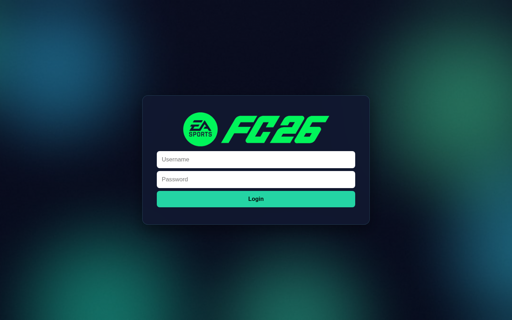
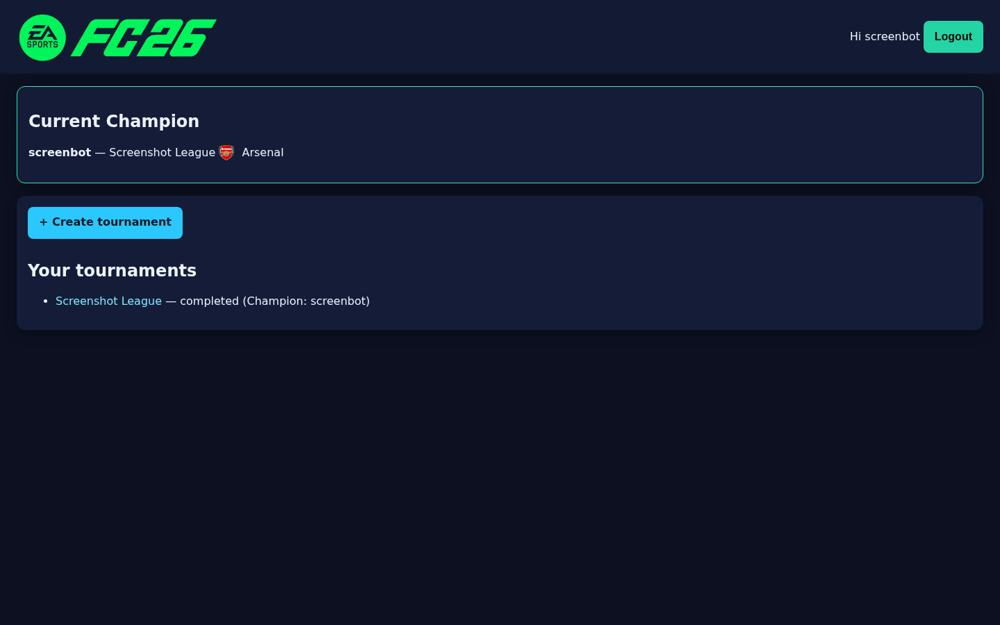
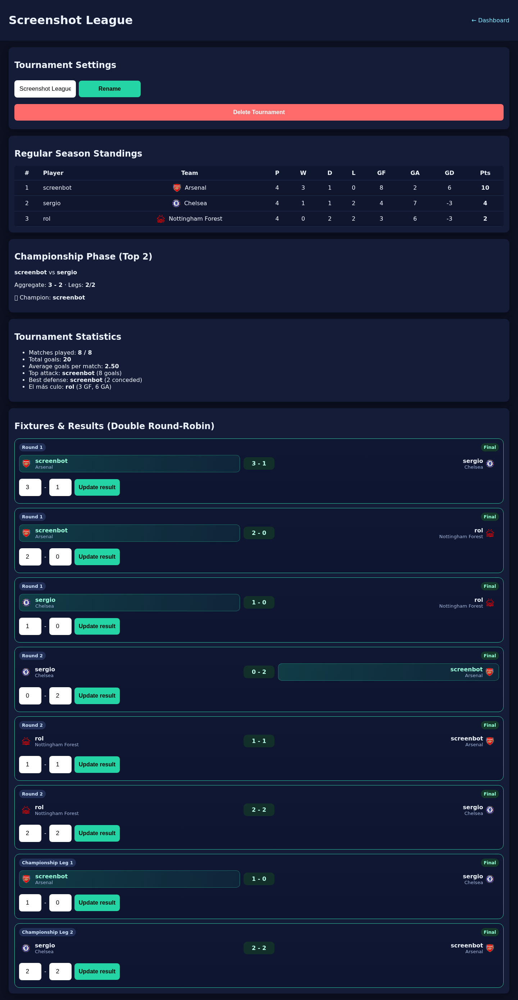

# FC26 Tournament Tracker

A clean web app to run **FC26 tournaments** with login, team selection, automatic fixtures, standings, and stats.

## Features

- 🔐 User authentication (register/login/logout)
- 🏆 Create tournaments with **2 to 10 players**
- 🌍 Team selection from major world leagues (Premier League, La Liga, Serie A, Bundesliga, Ligue 1, MLS, and more)
- 🔁 **Double round-robin** format (every matchup is played twice)
- 📊 Standings table with:
  - Player name
  - Team logo + team name
  - Played / Wins / Draws / Losses
  - Goals For / Goals Against / Goal Difference
  - Points (**Win = 3, Draw = 1, Loss = 0**)
- ⚽ Match result entry + goals tracking
- 📈 Tournament statistics (goals, avg goals, top attack, best defense)
- 👑 Main dashboard shows the **current champion**

## Tech Stack

- Node.js
- Express
- EJS templates
- SQLite (better-sqlite3)
- Express Session

## Screenshots

### Login


### Dashboard


### Tournament Standings & Stats


## Run locally

```bash
npm install
npm start
```

App runs on:

```text
http://localhost:3000
```

## Project structure

```text
fc26-tournaments/
├── db.js
├── server.js
├── teams.js
├── views/
├── public/
│   ├── style.css
│   └── screenshots/
└── data/
```

## Notes

- SQLite DB files are runtime artifacts and are ignored in git.
- Session secret defaults to a local value; for production set:

```bash
SESSION_SECRET=your_secret_here
```
